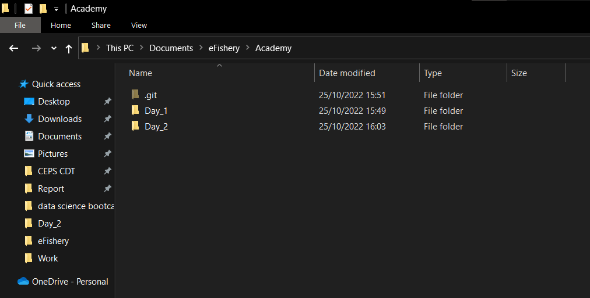

# Day 2 Assignment
Create GitHub repository using git for AquaDeveloper Batch 2 Wave 2 assignments

## Initialization
First, create directory in local machine by mkdir.

```bash
mkdir Academy
```

Since this Day_2_Assignment.md is commited in Day_2.

```bash
cd Academy
mkdir Day_2
```
In directory ../Academy we initialize git by git init.

```bash
git init
```
As a result ../Academy folder will have a hidden folder called .git as seen below



## Add & Commit
Whenever there are changes in local machine we need to use

```bash
git add .
git commit -m "Example Commit"
```
For example let us create a file called "test_notepad.txt" in ../Academy/Day_2
