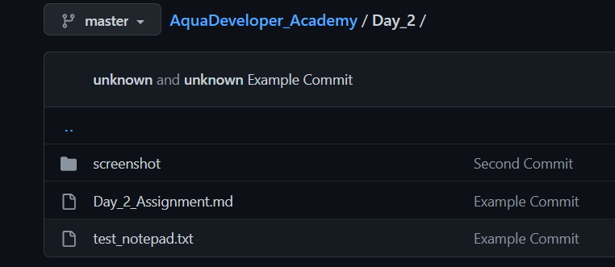
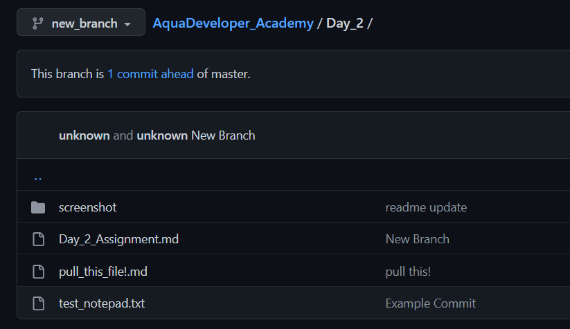
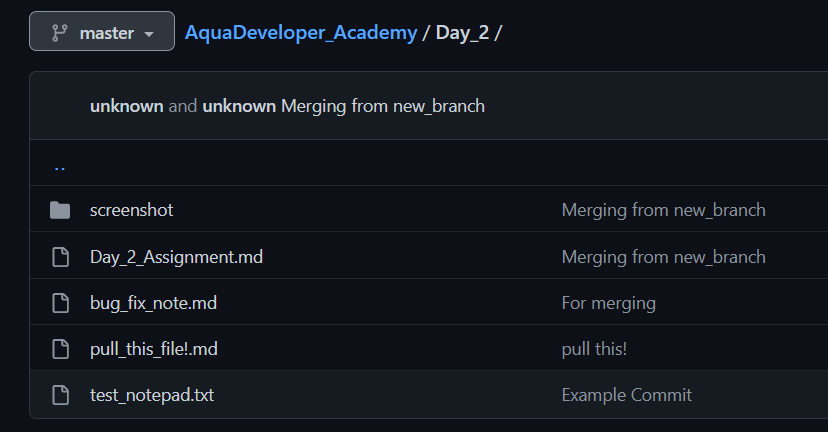

# Day 2 Assignment
Create GitHub repository using git for AquaDeveloper Batch 2 Wave 2 assignments

## Initialization
First, create directory in local machine by mkdir.

```bash
mkdir Academy
```

Since this Day_2_Assignment.md is commited in Day_2.

```bash
cd Academy
mkdir Day_2
```
In directory ../Academy we initialize git by git init.

```bash
git init
```
The terminal will show the following

```bash
PS C:\Users\Arymurti\Documents\eFishery\Academy> git init
Initialized empty Git repository in C:/Users/Arymurti/Documents/eFishery/Academy/.git/
```

As a result ../Academy folder will have a hidden folder called .git as seen below


## Add & Commit
Whenever there are changes in local machine we need to use

```bash
git add .
git commit -m "Example Commit"
```
For example let us create a file called "test_notepad.txt" in ../Academy/Day_2 

By using **git add .** All changes in local directory will be added to local branch 

Next with **git commit -m "Example Commit"** The changes

```bash
PS C:\Users\Arymurti\Documents\eFishery\Academy> git add .
PS C:\Users\Arymurti\Documents\eFishery\Academy> git commit -m "Example Commit"
[master c6d975f] Example Commit
 2 files changed, 12 insertions(+), 2 deletions(-)
 create mode 100644 Day_2/test_notepad.txt   
```
We could see that several changes has been saved, including the creation of "test_notepad.txt" in folder Day_2.

## Connect to GitHub Repository

Before we push our changes to a GitHub repository. We must first create the repository. In this case I've created https://github.com/SantoAry/AquaDeveloper_Academy.

To connect to my repository, I use

```bash
git remote add origin https://github.com/SantoAry/AquaDeveloper_Academy.git  
```

## Pushing to Github Repository

By all the previous step, we can finally push our local files into our GitHub repository by

```bash
git push origin master
```
The result will be shown in the following in terminal

```bash
PS C:\Users\Arymurti\Documents\eFishery\Academy> git push origin master
Enumerating objects: 12, done.
Counting objects: 100% (12/12), done.
Delta compression using up to 8 threads
Compressing objects: 100% (8/8), done.
Writing objects: 100% (9/9), 1.59 KiB | 541.00 KiB/s, done.
Total 9 (delta 2), reused 0 (delta 0), pack-reused 0
remote: Resolving deltas: 100% (2/2), done.
To https://github.com/SantoAry/AquaDeveloper_Academy.git
   e2cf96c..7d0bc93  master -> master
```
And we could see the changes in the GitHub repository as the following



## Pulling from GitHub to local machine

Let's say there is a change in GitHub repository. A file called "pull_this_file!.md" has appeared and we need to read them in local machine.

To do that we use

```bash
git pull origin master
```

The terminal will show

```bash
PS C:\Users\Arymurti\Documents\eFishery\Academy> git pull origin master      
remote: Enumerating objects: 6, done.
remote: Counting objects: 100% (6/6), done.
remote: Compressing objects: 100% (3/3), done.
remote: Total 4 (delta 0), reused 0 (delta 0), pack-reused 0
Unpacking objects: 100% (4/4), 824 bytes | 58.00 KiB/s, done.
From https://github.com/SantoAry/AquaDeveloper_Academy
 * branch            master     -> FETCH_HEAD
   4a916dd..1a2c933  master     -> origin/master
Updating 4a916dd..1a2c933
Fast-forward
 Day_2/pull_this_file!.md | 1 +
 1 file changed, 1 insertion(+)
 create mode 100644 Day_2/pull_this_file!.md
 ```
The terminal shows 1 insertion (+) for a file called Day_2/pull_this_file!.md and the pull to local machine was succesful

## Making a new branch

We want to make a new branch, to fix a code for example without tampering with our master branch.

To create a new branch we use

```bash
git checkout -b new_branch
```
Terminal shows

```bash
PS C:\Users\Arymurti\Documents\eFishery\Academy> git checkout -b new_branch  
Switched to a new branch 'new_branch'
```

To commit to our new branch, we once again do git commit with message "New Branch" and git push origin new_branch

```bash
git add .
git commit -m "New Branch"
git push origin new_branch
```
We therefore have created a new branch



## Merging another branch to master

Let's say we have made a bug fix in new_branch called "bug_fix_note.md" and we want to merge it to master. We can do that first by

```bash
git pull origin new_branch
```
Then

```bash
git add .
git commit -m "Merging from new_branch"
```
Then switch to master branch by

```bash
git checkout master
```
We merge new_branch with master by

```bash
git merge new_branch
```
In terminal it will show the changes

```bash
PS C:\Users\Arymurti\Documents\eFishery\Academy> git merge new_branch        
Updating 1a2c933..42ea659
Fast-forward
 Day_2/Day_2_Assignment.md       |  59 +++++++++++++++++++++++++++++++++++++++-
 Day_2/bug_fix_note.md           |   1 +
 Day_2/screenshot/new_branch.png | Bin 0 -> 28578 bytes
 3 files changed, 59 insertions(+), 1 deletion(-)
 create mode 100644 Day_2/bug_fix_note.md
 create mode 100644 Day_2/screenshot/new_branch.png
```
We then see "bug_fix_note.md" created in master branch

Finally, we push our new master to origin master by

```bash
git push origin master
```
With terminal output

```bash
PS C:\Users\Arymurti\Documents\eFishery\Academy> git push origin master      
Enumerating objects: 10, done.
Counting objects: 100% (10/10), done.
Delta compression using up to 8 threads
Compressing objects: 100% (6/6), done.
Writing objects: 100% (6/6), 26.32 KiB | 8.77 MiB/s, done.
Total 6 (delta 2), reused 0 (delta 0), pack-reused 0
remote: Resolving deltas: 100% (2/2), completed with 2 local objects.        
To https://github.com/SantoAry/AquaDeveloper_Academy.git
   1a2c933..42ea659  master -> master
```
As a result we could seee that branch master has been merged



It could be seen that for "bug_fix_note.md" the message is still "for merging" rather than "Merging from new_branch". It is because "bug_fix_note.md" does not change anything in branch master and therefore retains it's original message in branch new_branch.

## Closing statement
In this document, I have demonstrated a step by step tutorial of using git from initializing to push and to merging. It will undoubtedly be beneficial for the next lessons in AquaDeveloper. 