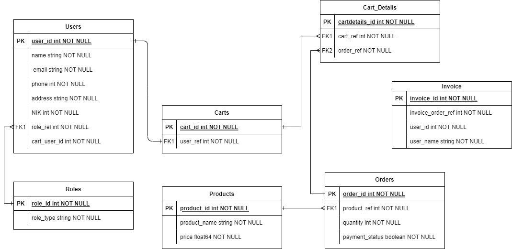

# eFishery Final Project (e-Commerce)

**Author:** A A Ngr Arymurti Santosa (Ary)

## Summary

Terdapat keperluan untuk membuat aplikasi e-commerce yang optimal. Basic API berupa CRUD untuk user. Kemampuan segregasi data, memilih produk, serta suatu sistem untuk menghasilkan bentuk pembayaran perlu dibentuk.

Maka dibentuk API e-commerce pada repository ini demi pengembangan e-commerce di eFishery.

## Problem & Motivation

Diperlukan sistem API untuk e-commerce produk pakan eFishery, khususnya untuk eMall. Hal ini dikarenakan tingginya _demand_ untuk produk perikanan dengan teknologi canggih. Postgresql digunakan untuk menyimpan database dan bahasa pemrograman Go digunakan untuk error handling API dan pembentukan relasi/manipulasi tabel dengan GORM. Echo framework juga digunakan untuk men-deploy API ke web server.

## Tables

Berikut adalah Entity Relationship Diagram (ERD) dari API ini:



Pada gambar.1 terdapat beberap tabel berupa Roles, Users, Carts, Cart_Details, Orders, Products, dan Invoice. Apa fungsi untuk masing-masing tabel?
* Roles -> Berfungsi untuk menetapkan roles yang ada untuk User_ID pada Users
* Users -> Menetapkan identitas user, roles_ref (role user)
* Carts -> Menetapkan cart_id yang unik untuk tiap user (customer & merchant)
* Cart_Details -> Memberikan record semua order yang telah dibentuk pada API dan cart_id yang di assign dari order tersebut
* Products -> Menetapkan informasi untuk suatu produk
* Orders -> Record pembelian produk yang secara default, nilai payment_status adalah false
* Invoice -> Saat record mendapatkan payment_status adalah true, Invoice akan dibentuk berdasarkan order_id dan menetapkan user_id, dan user_name untuk pembeli

## Dependencies
* Echo Framework
* GORM
* basicauth_middleware
* Postgresql

## Architecture
Kode API ini dibentuk dengan CLEAN architecture dimana packages, entities, error handling dapan dibentuk se-independent mungkin. Terdapat packages sebagai berikut pada API ini.
* Routes -> Routing untuk RESTful API menuju web-server
* Handler -> Handling request client serta memberikan respond kepada client
* Usecase -> Memproses request client dari handler dan diatur untuk memberikan respond yang sesuai untuk tiap API method 
* Repository -> Semua relasi dan manipulasi tabel, column, dan data dari database. Serta logika untuk mengambil data yang terbaik dilakukan pada package ini
* Entity -> Dimana objek struct didefinisikan untuk membuat tabel di database (User, Role, Product)
	* Response -> Dimana objek struct response client dibentuk (User, Role, Product)
	* Sub_Entity -> Dimana objek struct didefinisikan untuk membuat tabel di database (Cart, Cart Detail, Order, Invoice)
		* Sub_Response -> Dimana objek struct response client dibentuk (Cart, Cart Detail, Order, Invoice)
* Config -> Lokasi utama untuk konfigurasi program API. Untuk kasus ini, dimana link database diletakkan serta automigrate

## Dokumentasi API
Dokumentasi API dilakukan dalam bentuk file .json yang dapat di import kepada Postman, atau dibentuk pada Swagger.

![[PostMan.PNG]]
												Gambar.2 Dokumentasi API Pada Postman

Kemudian dengan mengisi editor.swagger.io dengan isi (For Swagger .json), didapatkan dokumentasi API pada Swagger seperti berikut.

![[Swagger.PNG]]
											Gambar.3 Dokumentasi API Pada Postman

Pada API Role & User, digunakan middleware basic auth untuk route group (/admin). 
* username: admin
* password: efishery

Pada API Products, middleware digunakan untuk (/merchant).
* username: merchant
* password: efishery

Pada API Orders, middleware digunakan untuk (/users) dan (/admin). Credential admin sama seperti diatas. Untuk credential users digunakan user_id pada username.

Flow Kerja API:
1. Awal dimulai dengan pembentukan Role ID berupa role_type (1: Admin, 2: Customer, 3: Merchant) dengan POST
2. Get all roles dapat dilakukan setelah No.1
3. Create user dapat dilakukan untuk menentukan identitas dan Role user
4. User dapat diambil berdasarkan ID dengan GET, dapat di update dengan UPDATE, dan dihapus dengan DELETE
5. Untuk mencari semua user dengan role tertentu gunakan Query Param users?roles=
6. Product mulai post dengan isi Nama Product, dan Price oleh Merchant
7. Product dapat diambil semua dengan GET all
8. Product dapat diambil sesuai ID
9. Product dapat diambil berdasarkan Nama (search function) dan di Sort berdasarkan harga (ascending dan descending) Query Param: search?name=Benih&sort_price=asc/desc
10. Product dapat di filter berdasarkan harga (more than and less than) menggunakan Query Param: filter?sort_type=more&price=1000
11. Cart dengan ID yang unik dibentuk untuk tiap User saat **User dibentuk**
12. Semua cart dapat dilihat dengan admin
13. Order dapat dipesan dengan Query Param: orders?user_id=... dan memasukkan body json untuk product_ref, quantity, dan payment_status: false.
14. Semua order dengan user_id tertentu dapat dilihat dalam tabel Cart Details dengan query param cartdetails?user_id=...
15. Untuk pembayaran, DELETE digunakan dan Query Param payment?order_id=...; Record untuk order tersebut akan di update dimana payment_status: true, dan kemudian dihapus. Info payment_status diterima client
16. Setelah order di DELETE, akan terbentuk record berupa Invoice dengan informasi khusus berupa order_ref, user_id, dan user_name.
17. Untuk melihat semua invoice untuk user_id tertentu gunakan GET dan Query Param /invoice?user_id=...

## How to run
1. Pull repository ini dan lakukan

```
go mod tidy
go mod run .
```
2. Open Postman (atau Swagger) dan atur route sesuai dengan Portnya, by default localhost:9000
3. Import API dengan .json collection, dan gunakan kode sesuai dengan flowchart API
4. Secara alternatif, gunakan docker Image dan docker compose dari file ini pada (repository image pada xanthos5/efisherydemo)
5. Run docker-compose

```
docker-compose up 
 ```
 or
```
docker-compose up -d
```

6. Lakukan step nomor 2 dan 3 kembali untuk menjalankan API
